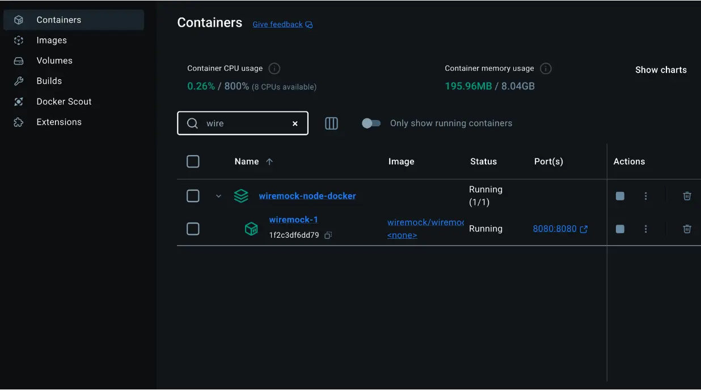
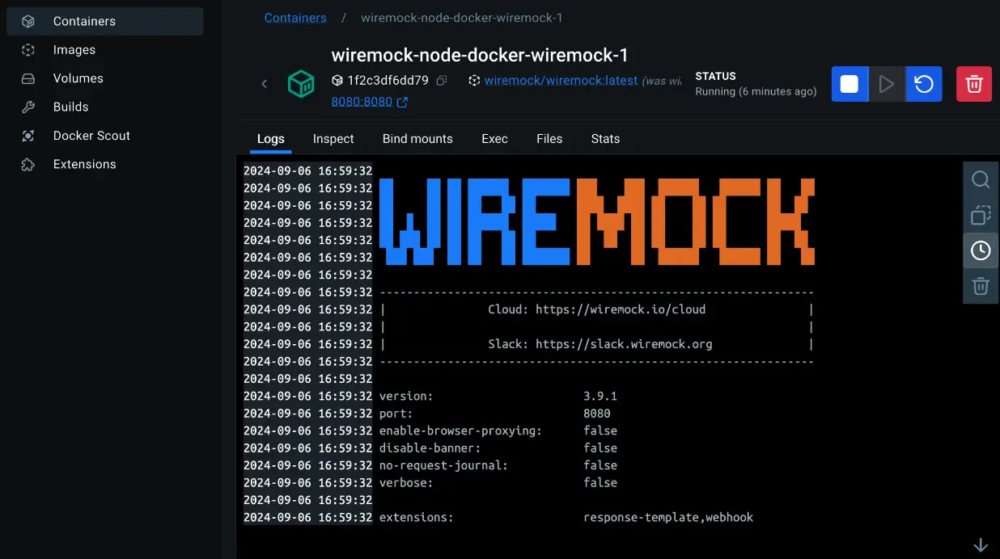
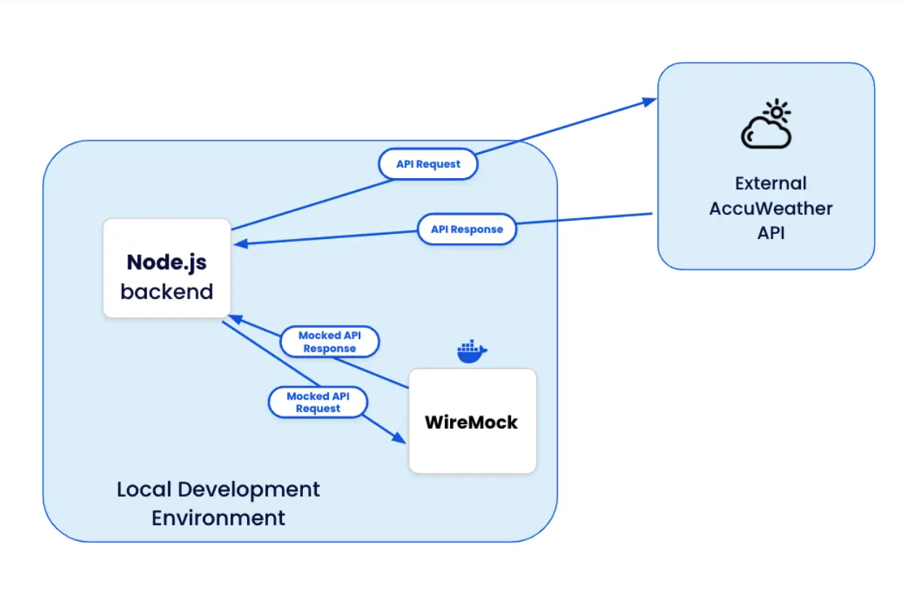
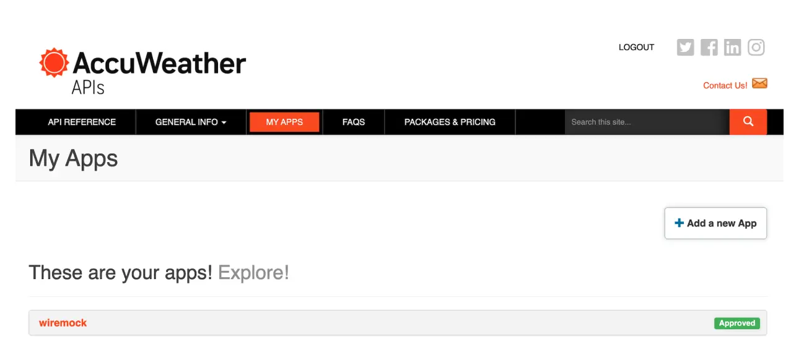

During local development and testing, it's quite common to encounter situations where your app is dependent on the remote APIs. Network issues, rate limits, or even downtime of the API provider can halt your progress. This can significantly hinder your productivity and make testing more challenging. This is where WireMock comes into play. 

WireMock is an open-source tool that helps developers to create a mock server that simulates the behavior of real APIs, providing a controlled environment for development and testing.

Imagine you have both an API and a frontend app, and you want to test how the frontend interacts with the API. Using WireMock, you can set up a mock server to simulate the API's responses, allowing you to test the frontend behavior without relying on the actual API. This can be particularly helpful when the API is still under development or when you want to test different scenarios without affecting the actual API. WireMock supports both HTTP and HTTPS protocols and can simulate various response scenarios, including delays, errors, and different HTTP status codes.

## Using WireMock with Docker

The official [Docker image for WireMock](https://hub.docker.com/r/wiremock/wiremock) provides a convenient way to deploy and manage WireMock instances. WireMock is available for various CPU architectures, including amd64, armv7, and armv8, ensuring compatibility with different devices and platforms. You can learn more about WireMock standalone on the [WireMock docs site](https://wiremock.org/docs/standalone/docker/).

### Prerequisites

The following prerequisites are required to follow along with this how-to guide:

* [Docker Desktop](https://www.docker.com/products/docker-desktop/)

### Launching WireMock

Launch a quick demo of WireMock by using the following steps:

 1. Clone the [GitHub repository](https://github.com/dockersamples/wiremock-node-docker) locally.

    ```console
    $ git clone https://github.com/dockersamples/wiremock-node-docker
    ```

 2. Navigate to the `wiremock-endpoint` directory

    ```console
    $ cd wiremock-node-docker/
    ```

    WireMock acts as the mock API that your backend will communicate with to retrieve data. The mock API responses have already been created for you in the mappings directory. 

 3. Start the Compose stack by running the following command at the root of the cloned project directory

    ```console
    $ docker compose up -d
    ```

    After a moment, the application will be up and running. 

    


    You can check the logs by selecting the **WireMock** container:

    

 4. Test the Mock API.

    ```console
    $ curl http://localhost:8080/api/v1/getWeather\?city\=Bengaluru
    ```
 
    It will return the following canned response with mock data:

    ```plaintext
    {"city":"Bengaluru","temperature":27.1,"conditions":"Mostly cloudy","forecasts":[{"date":"2024-09-02T07:00:00+05:30","temperature":83,"conditions":"Partly sunny w/ t-storms"},{"date":"2024-09-03T07:00:00+05:30","temperature":83,"conditions":"Thunderstorms"},{"date":"2024-09-04T07:00:00+05:30","temperature":83,"conditions":"Intermittent clouds"},{"date":"2024-09-05T07:00:00+05:30","temperature":82,"conditions":"Dreary"},{"date":"2024-09-06T07:00:00+05:30","temperature":82,"conditions":"Dreary"}]}
    ```

    With WireMock, you define canned responses using mapping files.
    For this request, the mock data is defined in the JSON file at
    `wiremock-endpoint/mappings/getWeather/getWeatherBengaluru.json`.
    
    For more information about stubbing canned responses, refer to the
    [WireMock documentation](https://wiremock.org/docs/stubbing/).


## Using WireMock in development

   Now that you have tried WireMock, let’s use it in development and testing. In this example, you will use a sample application that has a Node.js backend. This app stack has the following configuration:

  * **Local Development Environment**: The context in which the Node.js backend and WireMock are running.
  * **Node.js Backend**: Represents the backend application that handles HTTP requests.
  * **External AccuWeather API**: The real API from which live weather data is fetched.
  * **WireMock**: The mock server that simulates the API responses during testing. It runs as a Docker container.

  

  * The API Request is sent from the Node.js backend to the External AccuWeather API, which then returns the API Response.
  * Alternatively, when using WireMock, a Mocked API Request is sent to the WireMock server, and a Mocked API Response is returned.

  In this guide, you’ll learn how to:

  * Set up a non-containerized Node app to route requests to the containerized WireMock 
  * Set up a non-containerized Node app to fetch data from the external AccuWeather API.

  The application can be accessed at [dockersamples/wiremock-node-docker](https://github.com/dockersamples/wiremock-node-docker).


## Set up a non-containerized Node app to route requests to a containerized WireMock

Let’s set up a non-containerized Node app to route requests to the WireMock container instead of the external AccuWeather API. Assuming that Node is already installed on your system, follow the steps:

1. Navigate to the `accuweather-api` directory

   Make sure you're in the directory where your `package.json` file is located.

2. Set the environment variable.

   Open `.env` file placed under `accuweather-api/` directory. Remove the old entries and ensure that it just contains the following single line.
 
   ```plaintext
   API_ENDPOINT_BASE=http://localhost:8080
   ```

   This will tell your Node.js application to use the WireMock server for API calls. 

3. Start the Node server

   Before you start the Node server, ensure that you have already installed the node packages listed in the package.json file by running `npm install`. 

   ```console
   npm install 
   npm run start
   ```
 
   You should see the following output:

    ```plaintext
    > express-api-starter@1.2.0 start
    > node src/index.js

    API_ENDPOINT_BASE: http://localhost:8080
    ..
    Listening: http://localhost:5000
    ```

   The output indicates that your Node application has successfully started. It highlights the project name and the `index.js` file as the application's entry point. The `index.js` file initiates the `getWeather.js` file located within the `src/api/` directory by utilizing the `require` function to import the `api` module and subsequently invoking the `getWeather` function.

   The `getWeather.js` file plays a pivotal role within your Node.js application. The code commences by incorporating the `dotenv` module, which instructs the application to load environment variables from a `.env` file. Depending on the value of the `API_ENDPOINT_BASE` variable, the application intelligently directs requests either to the WireMock server (if set to `http://localhost:8080`) or the AccuWeather API. In this scenario, the request is being routed to the WireMock server.

    This code snippet ensures that the `ACCUWEATHER_API_KEY` is only required when the application is not using WireMock, preventing errors and improving efficiency.

    ```javascript
    require("dotenv").config();

    const express = require("express");
    const axios = require("axios");

    const router = express.Router();
    const API_ENDPOINT_BASE = process.env.API_ENDPOINT_BASE;
    const API_KEY = process.env.ACCUWEATHER_API_KEY;

    console.log('API_ENDPOINT_BASE:', API_ENDPOINT_BASE);  // Log after it's defined
    console.log('ACCUWEATHER_API_KEY:', API_KEY);          // Log after it's defined

    if (!API_ENDPOINT_BASE) {
      throw new Error("API_ENDPOINT_BASE is not defined in environment variables");
    }

    // Only check for API key if not using WireMock
    if (API_ENDPOINT_BASE !== 'http://localhost:8080' && !API_KEY) {
      throw new Error("ACCUWEATHER_API_KEY is not defined in environment variables");
    } 
    // Function to fetch the location key for the city
    async function fetchLocationKey(townName) {
      const { data: locationData } = await 
    axios.get(`${API_ENDPOINT_BASE}/locations/v1/cities/search`, {
        params: { q: townName, details: false, apikey: API_KEY },
      });
      return locationData[0]?.Key;
    }
    ```
    
    Keep this terminal window open. 

4. Test the Mocked API

   Open a new terminal window and run the following command to test the mocked API:

   ```console
   $ curl "http://localhost:5000/api/v1/getWeather?city=Bengaluru"
   ```

   You should see the following output:

   ```plaintext
   {"city":"Bengaluru","temperature":27.1,"conditions":"Mostly cloudy","forecasts":[{"date":"2024-09-02T07:00:00+05:30","temperature":83,"conditions":"Partly sunny w/ t-storms"},{"date":"2024-09-03T07:00:00+05:30","temperature":83,"conditions":"Thunderstorms"},{"date":"2024-09-04T07:00:00+05:30","temperature":83,"conditions":"Intermittent clouds"},{"date":"2024-09-05T07:00:00+05:30","temperature":82,"conditions":"Dreary"},{"date":"2024-09-06T07:00:00+05:30","temperature":82,"conditions":"Dreary"}]}%
   ```

   This indicates that your Node.js application is now successfully routing requests to the WireMock container and receiving the mocked responses

   You might have noticed that you’re trying to use `http://localhost:5000` as the URL instead of port `8080`. This is because your Node.js application is running on port `5000`, and it's routing requests to the WireMock container that's listening on port `8080`.

   > [!TIP]
   > Before you proceed to the next step, ensure that you stop the node application service.

## Set up a non-containerized Node app to fetch data from the external AccuWeather API 

   To enhance your Node.js application with real-time weather data, you can seamlessly integrate the AccuWeather API. This section of the guide will walk you through the steps involved in setting up a non-containerized Node.js application and fetching weather information directly from the AccuWeather API.


1. Create an AccuWeather API Key

   Sign up for a free AccuWeather developer account at[https://developer.accuweather.com/](https://developer.accuweather.com/). Within your account, create a new app by selecting `MY APPS` on the top navigation menu to get your unique API key.

   

    [AccuWeather API](https://developer.accuweather.com/) is a web API that provides real-time weather data and forecasts. Developers can use this API to integrate weather information into their applications, websites, or other projects.

2. Change directory to `accuweather-api`

   ```console
   $ cd accuweather-api
   ```

3. Set your AccuWeather API key using the `.env` file:

   > [!TIP]
   >  To prevent conflicts, ensure that any existing environment variables named `API_ENDPOINT_BASE` or `ACCUWEATHER_API_KEY` are removed before modifying the `.env` file.

   Run the following command on your terminal:

   ```console
   unset API_ENDPOINT_BASE
   unset ACCUWEATHER_API_KEY
   ```

   It’s time to set the environment variables in the `.env` file:

4. Install the dependencies

   Run the following command to install the required packages:

   ```console
   $ npm install
   ```

   This will install all the packages listed in your `package.json` file. These packages are essential for the project to function correctly.

   If you encounter any warnings related to deprecated packages, you can ignore them for now for this demonstration.

5. Assuming that you don’t have a pre-existing Node server running on your system, go ahead and start the Node server by running the following command:

   ```console
   $ npm run start
   ```
  
   You should see the following output:

   ```plaintext
   > express-api-starter@1.2.0 start
   > node src/index.js

   API_ENDPOINT_BASE: http://dataservice.accuweather.com
   ACCUWEATHER_API_KEY: <your_api_key] 
   Listening: http://localhost:5000
   ``` 
   
   Keep this terminal window open.

6. Run the curl command to send a GET request to the server URL.

   In the new terminal window, enter the following command:

   ```console
   $ curl "http://localhost:5000/api/v1/getWeather?city=Bengaluru"
   ``` 

   By running the command, you're essentially telling your local server to provide you with weather data for a city named `Bengaluru`. The request is specifically targeting the `/api/v1/getWeather` endpoint, and you're providing the query parameter `city=Bengaluru`. Once you execute the command, the server processes this request, fetches the data and returns it as a response, which `curl` will display in your terminal.

   When fetching data from the external AccuWeather API, you're interacting with live data that reflects the latest weather conditions. 


## Recap

This guide has walked you through setting up WireMock using Docker. You’ve learned how to create stubs to simulate API endpoints, allowing you to develop and test your application without relying on external services. By using WireMock, you can create reliable and consistent test environments, reproduce edge cases, and speed up your development workflow.

